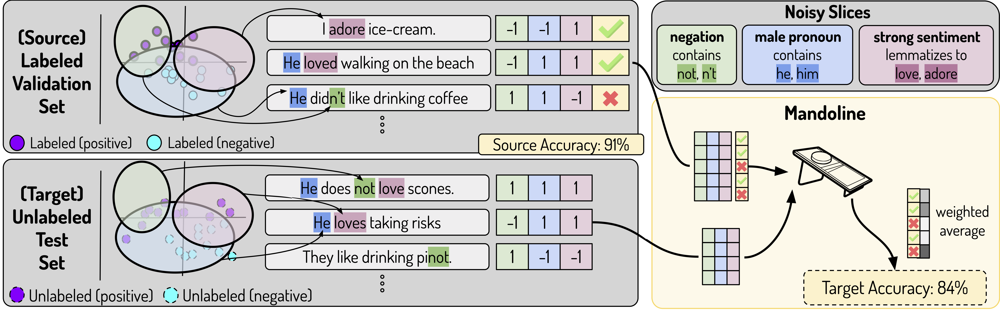

# Mandoline: Model Evaluation under Distribution Shift

Mayee Chen*, Karan Goel*, Nimit Sohoni*, Fait Poms, Kayvon Fatahalian, Christopher Re 

_*equal contribution_

---




### Abstract
> Machine learning models are often deployed in different settings than they were trained and validated on, 
posing a challenge to practitioners who wish to predict how well the deployed model will perform on a target distribution. 
If an unlabeled sample from the target distribution is available, along with a labeled sample from 
a possibly different source distribution, standard approaches such as importance weighting can be applied to estimate performance on the target. 
However, importance weighting struggles when the source and target distributions have non-overlapping support or are high-dimensional. 
Taking inspiration from fields such as epidemiology and polling, we develop Mandoline, 
a new evaluation framework that mitigates these issues. Our key insight is that practitioners may have prior knowledge about 
the ways in which the distribution shifts, which we can use to better guide the importance weighting procedure. 
Specifically, users write simple “slicing functions” — noisy, potentially correlated binary functions intended to capture 
possible axes of distribution shift to compute reweighted performance estimates. 
We further describe a density ratio estimation framework for the slices and show how its estimation error scales with slice quality and dataset size. 
Empirical validation on NLP and vision tasks shows that Mandoline can estimate performance on the target distribution up to 3x more accurately compared to standard baselines.

## Usage

Install with pip
```shell
$ pip install -r requirements.txt
```

Code for Mandoline is included in `mandoline.py` which is self-contained. 

The main entry points are `mandoline`, which can be used to run the Mandoline solver, and
`estimate_performance`, which can be used to run Mandoline, calculate importance weights
and compute estimates of target performance using e.g. observations of performance on
the source data.
```python
"""See `mandoline.py` for detailed docstrings"""

# Use this function to run Mandoline on slice-based representations of your source 
# & target data.
def mandoline(
    D_src: np.ndarray,
    D_tgt: np.ndarray,
    edge_list: np.ndarray,
    sigma: float=None,
):

# Use this function to run Mandoline *and* calculate metrics for target data.
def estimate_performance(
    D_src: np.ndarray,
    D_tgt: np.ndarray,
    edge_list: np.ndarray,
    empirical_mat_list_src: List[np.ndarray],
):
```

#### Example of `estimate_performance`
```python
# Assumes `construct_slice_representation` is a function that you wrote

# X_src is your source data matrix (n_src x feat dim) for which you have labels
D_src = construct_slice_representation(X_src) # D_src has shape (n_src x n_slices)

# X_tgt is your target data matrix (n_src x feat dim) for which you have no labels
D_tgt = construct_slice_representation(X_tgt) # D_tgt has shape (n_tgt x n_slices)

# Sample of code you might have written
def get_correct(model, X, labels):
    """
    Returns whether the model makes a correct prediction for each example in X.
    """
    correct = []
    for X_batch, labels_batch in zip(X, labels):
        preds = model(X_batch)
        correct.extend(preds == labels_batch)
    return np.array(correct)[:, np.newaxis]  # (n, 1) binary np.ndarray

# Empirical observations for the source data: a simple average would equal source accuracy
empirical_mat_list_src = [get_correct(model, X_src, labels_src)]

# Simple usage
estimate_performance(D_src, D_tgt, None, empirical_mat_list_src)
```

# About
For questions, please reach out to `mfchen [at] stanford [dot] edu`. 

If you use Mandoline in your work, please use the following BibTeX entry for citation:
```
@article{chenmandoline2021,
  title={Mandoline: Model Evaluation under Distribution Shift},
  author={Mayee Chen* and Karan Goel* and Nimit Sohoni* and Fait Poms and Kayvon Fatahalian and Christopher Re},
  journal={International Conference of Machine Learning (ICML)},
  year={2021},
}
```
